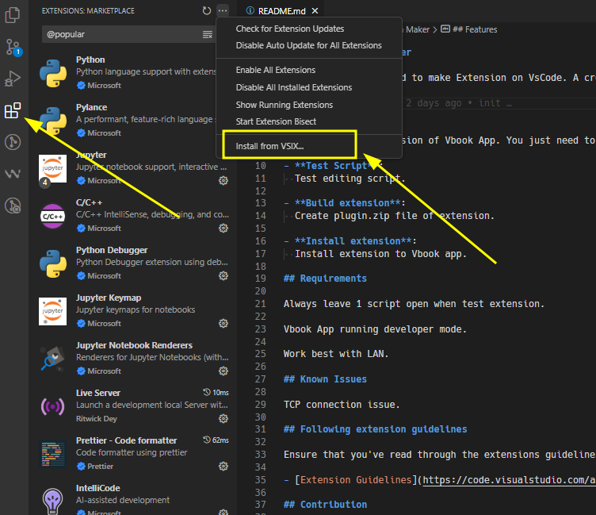
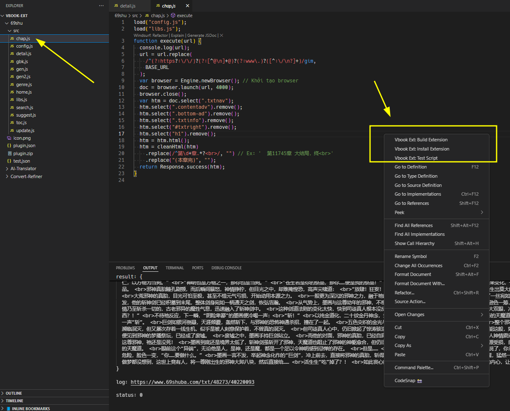

# Vbook Extension Maker

This VSCode extension created to make [Vbook Extension](https://github.com/Darkrai9x/vbook-extensions) on VSCode. A cross-platform approach.

## Installation

Open VSCode, choose `Install from VSIX...`, and pick installation file from explorer.

## Usage

Open at least 1 script, right click on editor to use commands.

_Other method: `Ctrl+Shift+P`_

## Requirements

Always leave at least 1 script open when test extension.

Vbook App running developer mode.

Work best with LAN.

## Features

- **Create Project**:
  Create sample extension of Vbook App. You just need to edit those files.

- **Test Script**:
  Test editing script.

- **Build extension**:
  Create plugin.zip file of extension.

- **Install extension**:
  Install extension to Vbook app.

## Known Issues

TCP connection issue.

## Contribution

Open a pull request. That easy.

Thank [ngatngay](https://github.com/pmtpro) for the PHP references.

**Enjoy!**
